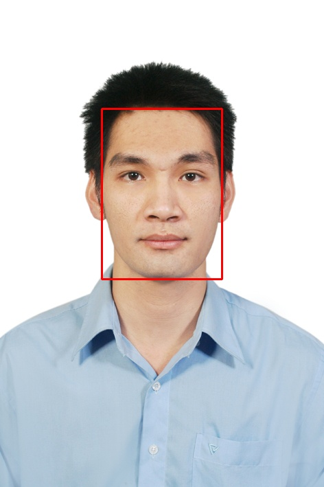

# Retinaface

A simple package of face detection

This package is built on top of the [Retinaface](https://github.com/biubug6/Pytorch_Retinaface)


- [More about Retinaface](#more-about-Retinaface)

- [Installation](#installation)

- [Usage](#Usage)

- [How to do a python package ](#How to do a python package)


## More about Retinaface

Retinaface is the State-of-the-art for Face Detection on WIDER Face. There are two versions of retinaface: MobileNet Backend and Resnet Backend. The model using MobileNet as backbone has only 1.7M, the other model with Resnet backbone has ~30m. Here is the performance on the FDDB dataset: 

| FDDB(pytorch) | performance |
|:-|:-:|
| Mobilenet0.25 | 98.64% |
| Resnet50 | 99.22% |

<p align="center"></p>

----

## Installation

```
$ pip install Pytorch-detection==0.0.1

```

----

## Usage

```python

from retinaface import RetinafaceDetector
import cv2 as cv


### Mobinet backbone 
detector  = RetinafaceDetector(net='mnet').detect_faces
img  = cv.imread('./imgs/DSC_8221.jpg')
bounding_boxes, landmarks = detector(img)
print(bounding_boxes)

### Resnet backbone 
detector  = RetinafaceDetector(net='mnet').detect_faces
img  = cv.imread('./imgs/DSC_8221.jpg')
bounding_boxes, landmarks = detector(img)
print(bounding_boxes)

```

#### Result 

<p align="center"></p>

## How to make a python package 

To create this project locally, create the following file structure:


```Shell
retinaface
    ├── retinaface
    │      ├── __init__.py
    ├── LICENSE
    ├── README.md
    ├── setup.py
    ├── setup.py
    ├── requirements.txt

```

#### Creating setup.py

setup.py is the build script for setuptools. It tells setuptools about your package

```python

import setuptools

setuptools.setup(
    name="Pytorch-detection", # Replace with your own username
    version="0.0.1",
    author="Hoang Phuong",
    author_email="hphuongdhsp@gmail.com",
    license='MIT',
    description = "A simple example package for face detection",
    long_description = long_description,
    long_description_content_type="text/markdown",
    url="https://github.com/hphuongdhsp/retinaface",
    packages=setuptools.find_packages(),
    classifiers=[
        "Programming Language :: Python :: 3",
        "License :: OSI Approved :: MIT License",
        "Operating System :: OS Independent",
    ],
    keywords='face detection, retinaface',
    install_requires=open('requirements.txt').readlines(),
    python_requires='>=3.6',
)

```
#### Creating README.md

#### Creating a LICENSE

#### Generating distribution archives

Install **setuptools** and **wheel**

```
$ pip install --user --upgrade setuptools wheel

```
make distribution files:

```
python3 setup.py sdist bdist_wheel
```

That command genetate two files in the **dist** directory:  

```Shell
   dist
    ├── Pytorch_detection-0.0.1-py3-none-any.whl
    ├── Pytorch-detection-0.0.1.tar.gz

```

#### Test in local 

```
$ pip install -e .
```


#### Uploading the distribution archives

First, make sure that you have an accout on Test PyPI. To register an account, go to https://test.pypi.org/account/register/. Then create a PyPI API token

Install  twine to to upload the distribution packages

```
$ sudo apt-get install -y twine

```

Run **twine** to upload all of the archives under dist:

```
$ python3 -m twine upload --repository testpypi dist/*

```

Output
```
Uploading distributions to https://test.pypi.org/legacy/

Enter your username: hphuongdhsp

Enter your password:

Uploading Pytorch_detection-0.0.1-py3-none-any.whl

100%|█████████████████████| 4.65k/4.65k [00:01<00:00, 2.88kB/s]

Uploading Pytorch-detection-0.0.1.tar.gz

100%|█████████████████████| 4.25k/4.25k [00:01<00:00, 3.05kB/s]
```


### To upload  your work to PyPi

To upload your package to PyPI, we can do similar way: 

+ Register an account on https://pypi.org

+ Use twine 

```
python3 -m twine upload dist/*
```
to upload your package and enter your credentials for the account you registered on the real PyPI.

Apter uploading your work, you can install by


```
$ pip install Pytorch-detection==0.0.1
```